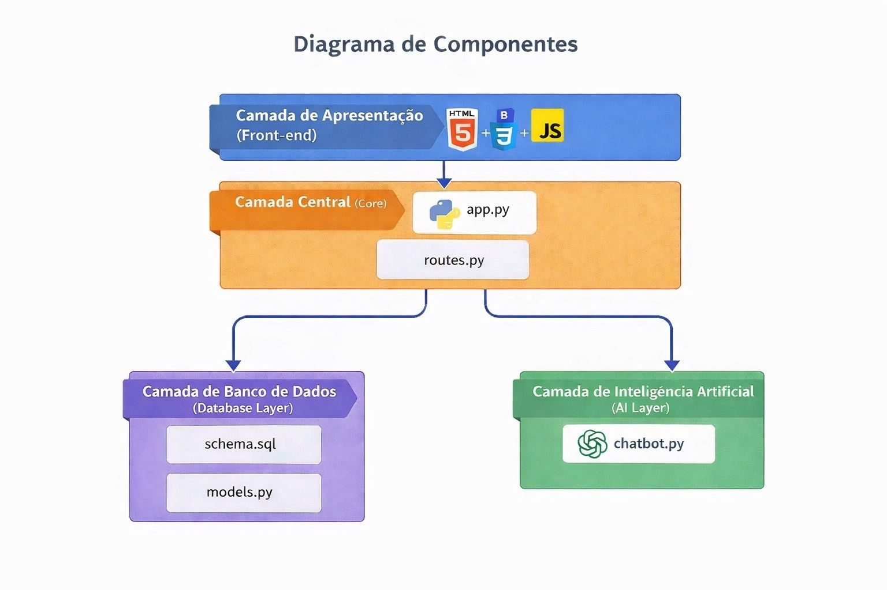

# Desafios de Arquitetura de Software
Desafio de Arquitetura de software feitos em equipe.

#### Turma: 3°P de SI (manhã)
#### Professor: Cloves Rocha
#### Equipe:
- Daniel Willian da Silva  (01831927)
- Emanuelly Araujo Alves de Lima  (01794503)
- Gabriel Arruda Caricchio  (01824947)
- Hanna Peixoto Parente de Araujo  (01802318)
- Ingrid Motta Santos  (01834701)
- Pedro Henrique José  (0180325)
- Tarsílio Aureliano Soares Silva  (01803880)

---

###### Ferramentas utilizadas:
- Visual Studio Code e git
- Extensões do Visual Studio Code:
 Color Highlight, DotENV, Error Lens, HTML CSS Support, Image preview, indent-rainbow, jinja, Live Share, Markdown Preview Enhanced, Material Icon, Python, Pylance, Python Debugger, Python Environments, Reload, TODO Highlight, Project Manager, vscode-pdf.

###### Linguagens e bibliotecas / frameworks:
- Front-end: HTML 5 e CSS3 (com Bootstrap), e JavaScript
- Back-end: Python 3.12.3 (com flask, openai e dotenv)
- IA: API da OPENAI (chat gpt)
- Banco de dados: SQL (SQLite)

##### Slide utilizado pela equipe :
- https://view.genially.com/69b4c55249561c5da797c05e/presentation-alfabetiza

##### Arquitetura utilizada no projeto:

