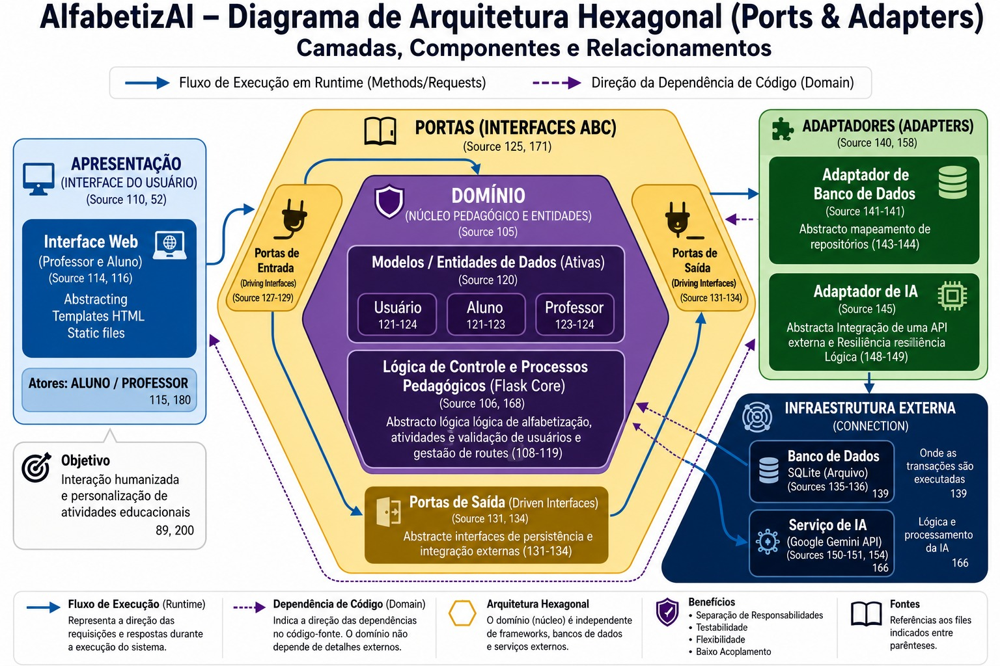

  <h1>Trabalho de Arquitetura de Software</h1>
  <h4>Professor: Cloves Rocha</h4>

   <table>
    <tr>
      <td align="center">
        <a href="https://github.com/profclovesrocha">
           
          <b>Cloves Rocha</b> 
          014200452
        </a>
      </td>
    </tr>
  </table>

    

  <h4>Turma: SI 3°P manhã</h4>
  <h4>Sistema: AlfabetizAI (site para alfabetização com AI)</h4>
  <h4>Equipe:</h4>

  <table width="100%" align="center">
    <tr>
      <td align="center" valign="top" colspan="3" width="25%">
        <a href="https://github.com/Daniel-Willian-Silva">
           
          <b>Daniel Willian da Silva</b> 
          Matrícula: 01831927
        </a>
      </td>
      <td align="center" valign="top" colspan="3" width="25%">
        <a href="https://github.com/GabrielCaricchio">
           
          <b>Gabriel Arruda Caricchio</b> 
          Matrícula: 01824947
        </a>
      </td>
      <td align="center" valign="top" colspan="3" width="25%">
        <a href="https://github.com/Ingrid-Motta06">
           
          <b>Ingrid Motta Santos</b> 
          Matrícula: 01834701
        </a>
      </td>
      <td align="center" valign="top" colspan="3" width="25%">
        <a href="https://github.com/hannaparente767">
           
          <b>Hanna Peixoto Parente de Araujo</b> 
          Matrícula: 01802318
        </a>
      </td>
    </tr>
    <tr>
      <td align="center" valign="top" colspan="4" width="33.3%">
        <a href="https://github.com/Pedroxxxz">
           
          <b>Pedro Henrique José</b> 
          Matrícula: 01803252
        </a>
      </td>
      <td align="center" valign="top" colspan="4" width="33.3%">
        <a href="https://github.com/EmanuellyLima07">
           
          <b>Emanuelly Araujo Alves de Lima</b> 
          Matrícula: 01794503
        </a>
      </td>
      <td align="center" valign="top" colspan="4" width="33.3%">
        <a href="https://github.com/TarsilioDev">
           
          <b>Tarsílio Aureliano Soares Silva</b> 
          Matrícula: 01803880
        </a>
      </td>
    </tr>
  </table>

---

###### Ferramentas utilizadas:
- Visual Studio Code;
- Extensões do Visual Studio Code:
 Color Highlight, DotENV, Error Lens, HTML CSS Support, Image preview, indent-rainbow, jinja, Live Share, Markdown Preview Enhanced, Material Icon, Python, Pylance, Python Debugger, Python Environments, Reload, TODO Highlight, Todo Tree, Project Manager, vscode-pdf, SQLite Viewer, Portuguese (Brasil) Language Pack for Visual Studio Code, Github Theme, Ayu, Git History;
- Git e github desktop;
- Monday (aplicativo estilo kambam para gestão de atividades e equipes)
- Gerenciador de pacotes UV;
- Discord (para video conferencias para colaboração).

###### Linguagens e bibliotecas / frameworks:
- Front-end: HTML 5 e CSS3 (com Bootstrap), e JavaScript;
- Back-end: Python 3.12.3 (com flask);
- IA: API da google (e modelo gemini-2.5-flash);
- Banco de dados: SQL (SQLite).

##### Arquitetura utilizada no projeto:
Para uma análise detalhada dos módulos, componentes e portas de comunicação, consulte o guia de [Análise da Arquitetura](./slides/arquitetura.md).

---

### Requisitos:
    Python 3.12.3

### Processo de instalação:
1. Criar ambiente virtual Python (venv)

Windows

    Criar: Abra o prompt de comando na pasta do projeto e digite:
    cmd

    python -m venv venv

    Ativar:
        CMD: venv\Scripts\activate.bat
        PowerShell: .\venv\Scripts\Activate.ps1
        Nota: Se o PowerShell bloquear a execução, use Set-ExecutionPolicy -ExecutionPolicy RemoteSigned -Scope Process antes. 

Linux / macOS

    Criar: Abra o terminal na pasta do projeto e digite:
    bash

    python3 -m venv venv

    Nota: Se necessário, instale o venv antes: sudo apt install python3-venv.
    Ativar:
    bash

    source venv/bin/activate

    O nome do ambiente, por exemplo (venv), aparecerá antes do prompt do terminal. 

2. Instalar dependencias usando o arquivo requirements.txt

        Para instalar bibliotecas Python usando um arquivo
        requirements.txt, utilize o comando pip install -r requirements.txt no seu terminal ou prompt de comando. Certifique-se de estar na pasta do projeto e com o seu ambiente virtual ativado para garantir a organização das dependências.

3. Reinicializar o vs code ou IDE utilizada

### Opção alternativa de instalação 
1.Instalação do gerenciador de pacotes UV

    Windows:
    pip install uv

    No macOS/Linux: 
    curl -LsSf https://astral.sh | sh

2. Reiniciar o vs code ou IDE utilizada

3. Sincronizar o projeto

        uv sync

### Para iniciar o sistema

      Dependendo do desafio, há na pasta um arquivo "run.py" , esse arquivo sé responsavel por inicializar o sistema, basta dar play nele e o sistema começa a funcionar, logo em seguida basta clicar no link que aparecer no terminal e será direcionado para o site.

### Observação:

     Crie um arquivo .env na pasta de adapters e coloque sua chave de API do google AI studio,  o nome da variável que guarda a chave de API deve ser GEMINI_API_KEY = "", e a chave de API deve estar entre aspas.

Link do site da google para criar uma chave de API (5 usos grátis diários):
https://aistudio.google.com/

