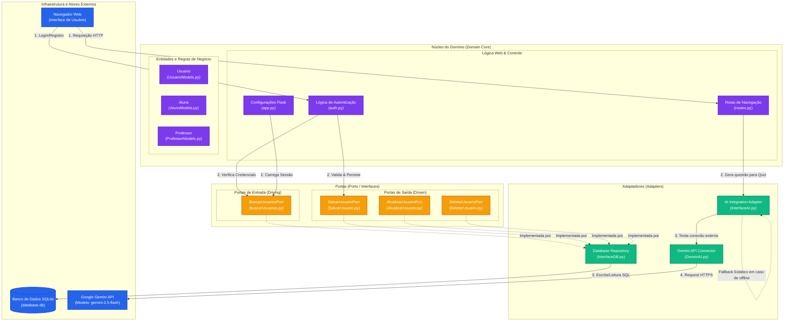

# Análise da Arquitetura do Projeto — AlfabetizAI

Este documento detalha a arquitetura de software implementada no projeto **AlfabetizAI** (Desafio 5 — Flask IMIP) a qual segue o padrão da **Arquitetura Hexagonal (Ports & Adapters)**.

---

## 1. Princípios de Design e Arquitetura

O projeto adota os padrões da **Arquitetura Hexagonal (Ports & Adapters)**. O objetivo principal desta arquitetura é isolar a lógica de negócios central (o núcleo/domínio) de agentes e tecnologias externas. 

### Benefícios no AlfabetizAI:
* **Desacoplamento de tecnologia:** O núcleo de regras do negócio e modelos de dados não depende diretamente do ciclo de vida da da IA ou banco de dados.
* **Flexibilidade de Persistência:** A gravação e recuperação de dados de usuários ocorrem por meio de portas. Se decidirmos trocar o banco de dados de SQLite (SQLAlchemy) para outro mecanismo (como Firebase, PostgreSQL ou mesmo arquivos locais), o domínio não precisa ser alterado.
* **Segurança e Fallbacks Resilientes:** O acesso a serviços externos (como a API do Google Gemini) é encapsulado por um adaptador de integração, permitindo fornecer um fallback estático de perguntas caso o serviço esteja offline ou sem chaves configuradas.

---

## 2. Diagrama de Arquitetura (Mermaid)

Abaixo está a representação visual dos componentes e fluxos de dados do sistema. As dependências e interações apontam sempre para o interior do hexágono (em direção ao domínio).

---

## 3. Legenda e Mapeamento de Componentes

### A. Núcleo do Domínio (`prototipo/domain/`)
* **`core/app.py`:** Inicializador do Flask. Configura o servidor, as pastas de templates e estáticos, inicializa a sessão com `LoginManager` e registra os blueprints de rotas e autenticação.
* **`core/auth.py`:** Controla as operações de registro e sessão do usuário. É aqui que os dados recebidos da UI são validados e transformados em modelos do domínio. Utiliza as portas para persistência.
* **`core/routes.py`:** Mapeia os endpoints expostos ao navegador (como `/`, `/quiz`, `/biblioteca` e `/evolucao`). A rota `/api/questao` delega ao adaptador de IA a tarefa de gerar perguntas de alfabetização.

* **`front-end/`:** contem a interface do usuário:**
  * `static`: Contem as pastas images, css e js.
  * `templates`: Contem os arquivo html

* **`models/`:** Contém as entidades ativas da aplicação:
  * `UsuarioModels.py`: Tabela base de usuários contendo dados pessoais (CPF, e-mail, senha criptografada).
  * `AlunoModels.py` e `ProfessorModels.py`: Entidades que estendem o usuário básico para representar o perfil de Alunos (com informações de escolaridade, nível de leitura e internação hospitalar) e de Professores (com especialidade e disciplina de atuação).

### B. Portas (`prototipo/ports/`)
* **Driving Ports (Entrada):**
  * `driving/buscarUsuarios.py` (`BuscarUsuariosPort`): Interface abstrata usada pelo Flask (`LoginManager` e fluxo de login) para verificar a existência de usuários por ID, e-mail, matrícula ou CPF, blindando o domínio contra acessos SQL diretos.
* **Driven Ports (Saída):**
  * `driven/SalvarUsuario.py` (`SalvarUsuarioPort`): Interface abstrata para criação e persistência física de novas entidades `Usuario`, `Aluno` ou `Professor`.
  * `driven/AtualizarUsuario.py` (`AtualizarUsuarioPort`): Interface abstrata para modificação de dados dos usuários.
  * `driven/DeletarUsuario.py` (`DeletarUsuarioPort`): Interface abstrata para exclusão de perfis.

### C. Adaptadores (`prototipo/adapters/`)
* **`repositories/InterfaceDB.py` (`DatabaseRepository`):** O adaptador de banco de dados concreto. Ele implementa as portas de persistência (`Salvar`, `Atualizar`, `Deletar`, `Buscar`) mapeando as intenções do domínio para operações SQLAlchemy na sessão do banco SQLite.
* **`integrations/InterfaceAI.py`:** Funciona como um intermediador inteligente de IA. Ele tenta utilizar a chave de API do Gemini para conectar-se ao serviço em nuvem; se a cota expirar, se a chave `.env` estiver ausente ou caso a IA apresente algum erro, ele tenta outra IA, se não tiver ele ativa um fallback local com uma questão pré-programada (garantindo resiliência).

### D. Conexões Externas e Infraestrutura (`prototipo/conection/` & `instance/`)
* **`api/gemini/GeminiAI.py`:** Mapeia a chamada real do da API do Google (`google-generativeai`). Configura o prompt de sistema especializado em alfabetização para crianças, requisitando um retorno estrito em formato JSON e o modelo `gemini-2.5-flash`.
* **`database/database.db` ou `instance/database.db`:** Banco de dados SQLite contendo o arquivo físico onde as transações são de fato executadas.
* **`domain/front-end/` (Apresentação):** Arquivos HTML (Jinja2), CSS com Bootstrap e Javascript. É o canal por onde os atores interagem com o hexágono.

---

## 4. Fluxo de Dados de Exemplo

### Caso de Uso: Registro de um Novo Aluno
1. O usuário preenche o formulário na página `/registro` (`UI`).
2. O formulário envia uma requisição `POST` para `auth.py` (`Domain/Core`).
3. O domínio valida os campos e faz consultas através de `BuscarUsuariosPort` para garantir que o CPF/e-mail/matrícula são únicos.
4. O domínio instancia as classes de entidade do domínio (`Usuario` e `Aluno`).
5. O domínio chama a porta `SalvarUsuarioPort.salvar_usuario()`.
6. O adaptador `DatabaseRepository` intercepta a chamada, adiciona os objetos à sessão do SQLAlchemy (`db.session.add(usuario)`) e executa o `commit()`.
7. O banco SQLite grava fisicamente as linhas na tabela.
8. Uma mensagem de sucesso retorna para o usuário na interface web.
