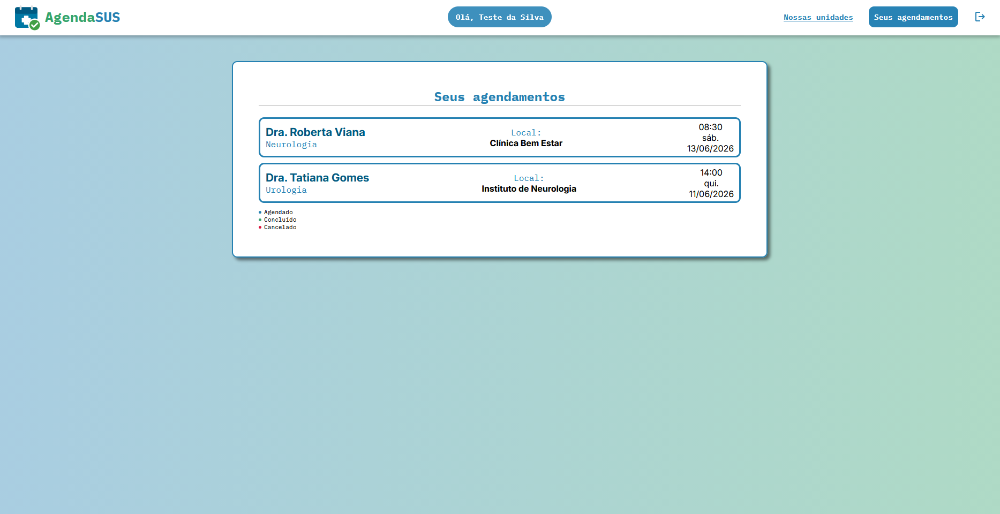

# Grupo (3o Período Noite)

- Rodrigo Nunes Peixoto Ramos
- Daniel Dantas de Farias
- Ericlys Severino da Silva
- Márcio José da Silva Morais Junior
- Othon Henrique Queiroz de Oliveira

# Agenda SUS

- Nosso propósito é facilitar a vida dos usuários da saúde pública na região. No site, é possível filtrar consultas, agendar, verificar as agendadas médicas e verificar as clínicas públicas na região metropolitana do Recife.

## Utilização

- **Linguagem:** Python
- **Framework/Biblioteca:** Flask / React
- **Banco de Dados:** MySQL
- **Ferramentas:** Docker / Git

## Setup do Projeto

Para rodar o projeto localmente, foi criado um ambiente empacotado e pronto para ser executado através de um container Docker, sendo ele um **pré-requisito**. Portanto, é necessário ter o **Docker instalado e funcionando**. 
* [Instalar Docker.](https://www.docker.com/products/docker-desktop/)

#### Executando o Projeto

1. Clonar repositório:
```bash
git clone https://github.com/Rodrigonpp/AgendaSUS
cd AgendaSUS
```

2. Subir o container:
```bash
docker compose up --build
```

Pronto! A aplicação está disponível em: [http://localhost:8080](http://localhost:8080) para a própria máquina. Ou no IP da máquina, utilizando também a porta **8080**. Exemplo: `http://192.168.0.10:8080`.

3. Encerrando a aplicação:
Para encerrar a aplicação, basta usar o comando `Ctrl+C` no seu terminal.


## Funcionabilidades

-Login


-Cadastro


-Tela inicial


-Agendamento


-Nossas unidades


-Consultas agendadas

